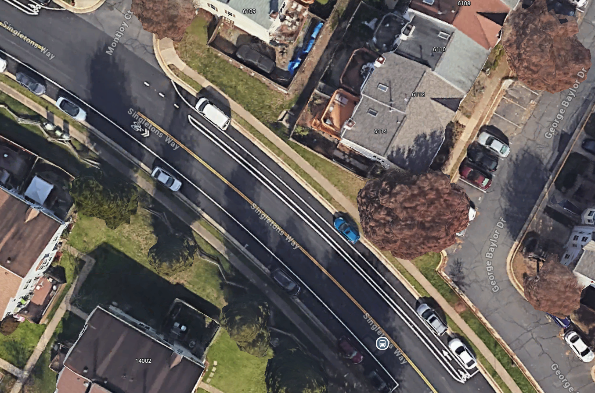

A few days ago, on a Friday, a resident I did not know called me and asked
what the proper parallel parking space dimensions should be. 
I have limited experience designing parking spaces. However, I remembered
that the Virginia Road Design Manual Appendix A covers pedestrian,
bicycle, and parking-related topics. I asked the person to please hold for
a minute while I opened the manual to look for the dimension.

While quickly flipping through the pages, I was surprised that I could not
find a direct answer to the question. I then searched the document using
the keyword “parallel,” but still could not locate a clear dimension.
I explained that I could not find the answer immediately, but I would
research it and get back to the person later.

## What's the Exact Dimension?

The Road Design Manual includes design dimensions for parallel parking
spaces. It requires a **minimum width of 7 feet measured from the face of
curb** for residential and mixed-use local streets, and **8 feet** for
commercial and industrial areas.

The manual does not specify a stall length because parallel parking spaces
are typically not marked individually. Instead, they are marked as a
continuous parking lane (see below figure as an example). In many cases, 
the parking lane is not painted at
all. If the roadway is wide enough and parking is not prohibited by
signs, vehicles may park along the roadside.

<!--  -->
<figure style="text-align:center;margin-top:40px;">
  
  <figcaption>Parallel Parking Lane Example</figcaption>
</figure>

This raises the question: What if we want to mark individual parallel
parking spaces? What should the stall length be?

I asked Google Gemini this question. The response indicated that stall
length is typically determined by local requirements and that there is no
statewide design standard.

I then asked specifically about Fairfax County. The response stated that
the typical dimension is **8 feet in width and 22 feet in stall length**.
I also requested a reference link, which led to the Fairfax County
[Public Facilities Manual, Chapter 7](https://online.encodeplus.com/regs/fairfaxcounty-va-pfm/doc-viewer.aspx?secid=366#secid-366).
The figure below is reproduced from the manual.

<figure style="text-align:center;margin-top:40px;">
  
  <figcaption>Parallel Parking Space Dimension</figcaption>
</figure>